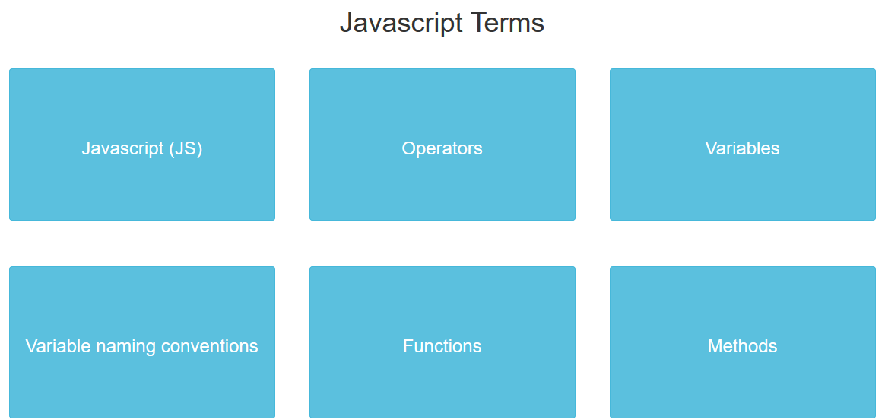
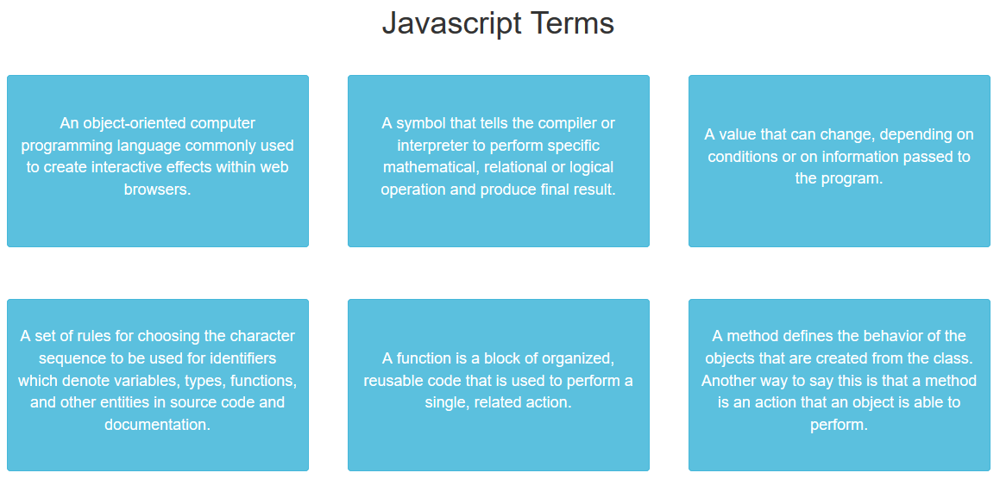

# _Flashcards of Javascript Terms_

#### _Exercise in jQuery Basics, 01.14.2020_

#### By _**Tiffany Siu and Sasa Schwartz**_

## Description

This program was to practice jQuery basics of elements and showing/hiding sections.  It also helped in learning by reviewing javascript terms and definitions.  The flashcards on the site can be clicked to toggle between showing the term and showing the definition of that term.

## Setup/Installation Requirements

### Requirements to Run
* _Web Browser_

### Other Resources Used
* _JQuery_
* _Bootstrap_

### Instructions
_This page may be viewed by cloning the [repository](https://github.com/TSiu88/flashcards.git) from my [GitHub page](https://github.com/TSiu88) and opening the **index.html** file in any web browser._

## Technologies Used

* _HTML_
* _CSS_
* _Javascript_
* _JQuery_
* _Bootstrap_
* _Markdown_

## Notable Features
_This program is a good study guide to ensure the correct terminology for javascript is known.  It also uses flex and wrap to ensure that the flashcards are appropriately spaced on the page._

## Specifications

* _Show all flashcards with terms shown for each one_
  * _Example Input: load page_
  * _Example Output: "Javascript(JS)", "Functions", "Arguments", etc._
* _Show definition of term when flashcard is clicked_
  * _Example Input: "Functions" clicked_
  * _Example Output: "A function is a block of organized, reusable code that is used to perform a single, related action"_
* _Show term again when flashcard is clicked_
  * _Example Input: "A value that is passed between programs, subroutines, or functions" clicked_
  * _Example Output: "Arguments"_

## Screenshots

_Here is a snippet of what the input looks like:_

_Here is a preview of what the output looks like:_

## Known Bugs

_There are currently no known bugs in this program_

## Support and contact details

_If there are any question or concerns please contact me at my [email](mailto:tsiu88@gmail.com). Thank you._

### License

*This software is licensed under the MIT license*

Copyright (c) 2020 **_Tiffany Siu, Sasa Schwartz_**
